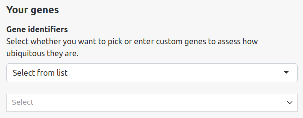
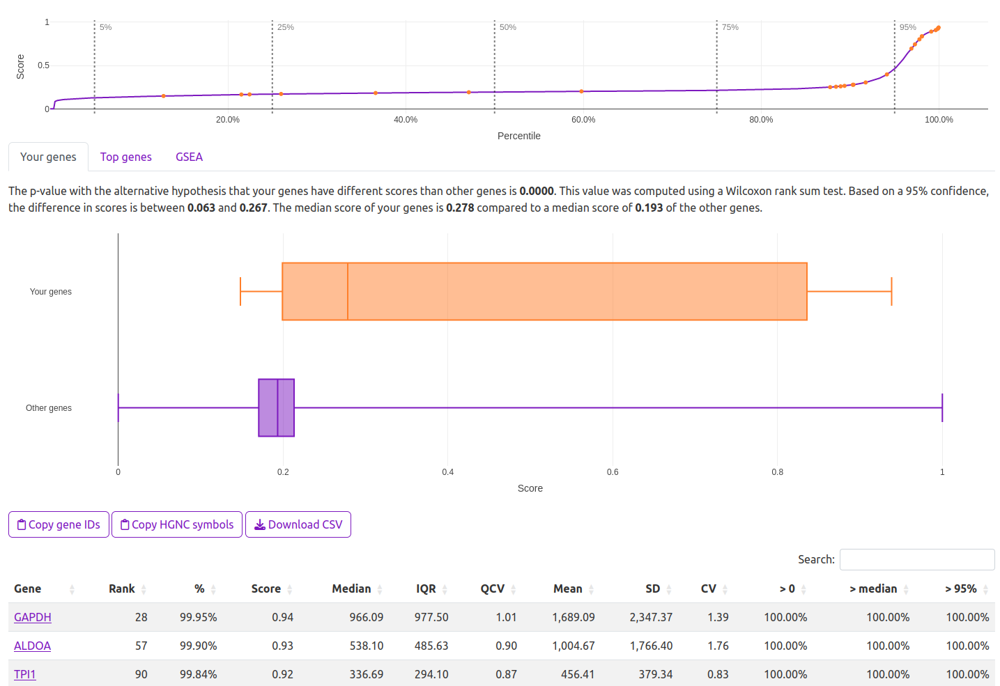
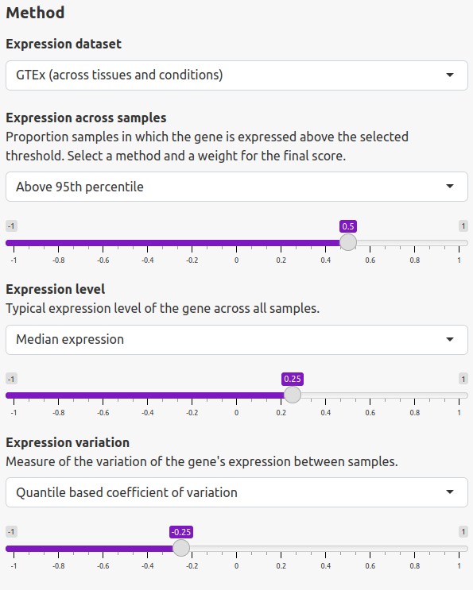
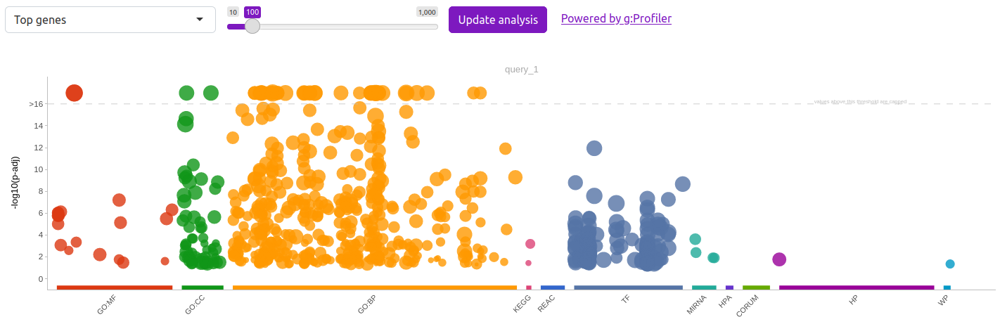

## What is Ubigen?

Ubigen is a tool for analyzing genes for their ubiquity within expression
datasets. We provide results from common data sources for expression data
including [GTEx](https://gtexportal.org) and the
[Human Protein Atlas](https://www.proteinatlas.org) within this interactive
web interface as well as via an HTTP API. The freely available
[`ubigen`](https://ubigen.uni-rostock.de/code) R package also supports analyses
within custom datasets from the command line or interactively.

## How can I analyze my genes of interest?

You can easily analyze your genes of interest for their ubiquity. In the
initial state of the application, you can select genes by their HGNC symbols
from a dropdown menu. To paste your genes as a whitespace separated list of
either HGNC symbols or Ensembl gene IDs (in the form `ENSG00000164362`), change
the top dropdown from "Select from list" to the desired input method. It is also
possible to select sample data (genes involved in glycolysis according to the
KEGG pathways database [`KEGG:hsa00010+M00001`]).

## Which information does the tool give for my genes of interest?

Once your genes have been selected, the user interface will automatically switch
to the "Your genes" tab. The following information will be available online and
for download (to download the visualizations, click on the camera button in
their top right corner):

1. The overview plot showing the overall distribution of ubiquity with your
   custom genes highlighted.
2. A textual summary comparing your selected genes with the overall ranking.
   This includes the p-value and confidence interval resulting from a Wilcoxon
   rank sum test with the alternative hypothesis that your genes have different
   scores than other genes. Please also note the given effect size.
3. A boxplot comparing the scores of your genes with those of all other genes.
4. A detailed table (downloadable as CSV) including scores, ranks and
   percentiles as well as the computed parameters for your genes.

## How can I change the parameters of the method?

The panel on the left side offers multiple controls to change the parameters of
the method. These include the selection of the expression dataset and the
choices for each of the different criteria used to compute the ubiquity score
as well as their weight contributing to that score. These are the criteria:

| Criterion                                | Description                                                                                                                                                                                                                                                                                               | Default Weighting |
| ---------------------------------------- | --------------------------------------------------------------------------------------------------------------------------------------------------------------------------------------------------------------------------------------------------------------------------------------------------------- | ----------------- |
| Fraction of samples with high expression | Fraction of samples that express the gene based on a specified threshold. The threshold is computed separately for each sample and corresponds to the 95th percentile of expression within that sample. It is possible to select the median (i.e., the 50th percentile) or zero as reference values, too. | 50%               |
| Expression level                         | The median expression level (logarithmic) is determined for each gene across all samples. Alternatively, it is possible to select the mean expression.                                                                                                                                                    | 25%               |
| Expression variation                     | Measure of the variation of a gene’s expression between samples. By default, the interquartile range (IQR) normalized by the median is used. Other options include the IQR itself, the standard deviation and the coefficient of variation.                                                               | -25%              |

## What does the GSEA tab do?

The "GSEA" tab provides a simple gene set enrichment analysis using
[g:Profiler](https://biit.cs.ut.ee/gprofiler/gost). This shows the significance
of over-representation of annotated genes in the top part of the ranking which
is a way to insinuate the biological or at least scientific relevance of the
scoring.

## How can I perform analyses of ubiquity relative to my own expression dataset?

Because of the computational requirements we can not publicly provide this
service. We are open to suggestions for inclusion of other general and publicly
available expression datasets into the public service
[on request](mailto:elias.projahn@uni-rostock.de). It is always possible to run
the algorithms and also the interactive web interface on your own hardware using
the [`ubigen`](https://ubigen.uni-rostock.de/code) R package.